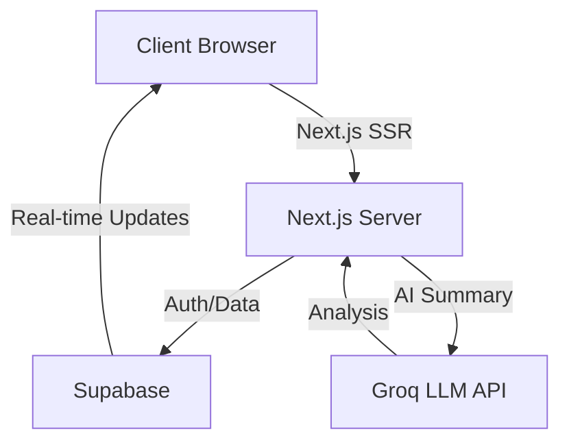
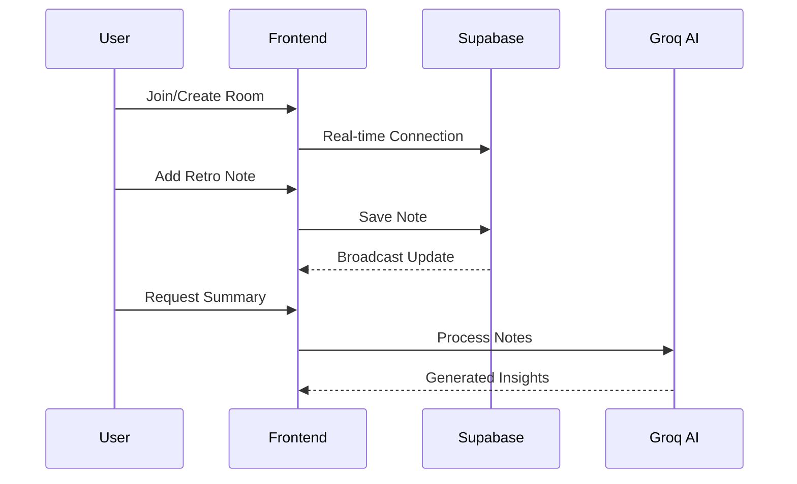

# 🚀 LetRetro - Modern Agile Retrospective Tool


<p align="center">
  The next-generation collaborative retrospective platform for agile teams
</p>

<p align="center">
  <a href="https://nextjs.org/"></a>
  <a href="https://www.typescriptlang.org/"></a>
  <a href="https://tailwindcss.com/"></a>
  <a href="https://supabase.com/"></a>
</p>

## ✨ Features

- 🔐 **Secure Authentication** - Email/password and social login options
- 👥 **Real-time Collaboration** - Multiple participants can add notes simultaneously  
- 🤖 **AI-Powered Summaries** - Get instant insights with LLama 3 powered analysis
- 🎯 **Focused Discussions** - Organized columns for different retrospective categories
- 🔒 **Private Rooms** - Create invite-only retrospective sessions
- 👻 **Anonymous Mode** - Option to hide participant names
- 🎮 **Engaging UI** - Gamified interactions and animations
- 📱 **Responsive Design** - Works seamlessly across devices

## 🏃‍♂️ Quick Start

### Prerequisites

- Node.js 16+  
- pnpm/npm  
- Supabase account  
- Groq API key (for AI features)  

### Environment Setup

Create a `.env.local` file:

```env
NEXT_PUBLIC_SUPABASE_URL=your_supabase_url
NEXT_PUBLIC_SUPABASE_ANON_KEY=your_supabase_anon_key
GROQ_API_KEY=your_groq_api_key
```

### Installation

```bash
# Clone the repository
git clone https://github.com/dhanushk-offl/letretro_v2.git

# Install dependencies
npm install

# Run development server
npm dev

# Build for production
npm build
```

## 🏗️ Architecture



## 🔄 Workflow



## 🔧 Tech Stack

- **Frontend**: Next.js 13, TypeScript, TailwindCSS  
- **Backend**: Next.js API Routes  
- **Database**: Supabase (PostgreSQL)  
- **Real-time**: Supabase Real-time  
- **AI**: Groq (Llama 3)  
- **UI Components**: Radix UI, Lucide Icons  
- **Authentication**: Supabase Auth  

## 📝 Project Structure

```
letretro/
├── app/                  # Next.js 13 app directory
│   ├── api/             # API routes
│   ├── dashboard/       # Dashboard pages
│   ├── room/            # Retrospective room
│   └── auth/            # Authentication pages
├── components/          # React components
├── lib/                 # Utility functions
├── hooks/               # Custom React hooks
├── styles/              # Global styles
└── public/              # Static assets
```

## 🔐 Security

- JWT-based authentication  
- Real-time permission checks  
- Rate limiting on API routes  
- Input sanitization  
- Secure environment variables  

## 🎨 Customization

To customize the look and feel, modify `tailwind.config.ts`:

- Colors  
- Fonts  
- Spacing  
- Breakpoints  
- Themes  
